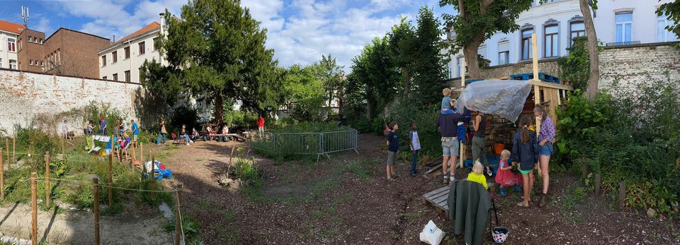

# full-projects-starter

## structure

index.html -> html code
css/* -> styling
js/* -> javascript code
js/* -> javascript directory
 <!-- search engine
 

          <form action="/action_page.php">
            <input type="text" placeholder="Search.." name="search">
          </form>
        
--!>
 /*@media (min-width: 750px) {
    body {
        font-family: Verdana, sans-serif;
        margin: 0
    }

    header {
        background-color: white;
        width: 100%;
    }

    .bar {
        margin-top: 15px;
        margin-left: 5%;
        margin-right: 5%;
        background-color: white;

    }

    .container {
        position: relative;
        text-align: center;
        color: white;
        background-color: rgba(255, 255, 255, 0.4);

    }

    .logo img {
        float: left;
        width: 90px;
        height: auto;
        position: relative;
        transform: translate(10%, -980%);

    }

    .logo2 {

        position: absolute;
        top: 45%;
        left: 50%;
        transform: translate(-50%, -50%);

    }

    .navigation a {

        text-decoration: none;
        border-radius: 30px;
        padding: 15px;
        color: black;
        text-decoration: none;
        font-family: 'inter';
        font-weight: bold;
    }

    .navigation a:hover {
        text-decoration: underline solid black;
    }

    .search-container {
        margin-top: 15px;
    }

    .navigation {
        position: relative;
        transform: translate(0%, -1150%);
        display: flex;
        justify-content: space-around;
        float: right;
        background-color: rgba(255, 255, 255, 0.4);
    }

    a {
        border-radius: 0%;
        text-align: center;
        color: white;
        text-decoration: none;
    }

    .us {
        width: 100%;
        height: 400px;
        position: absolute;
        display: flex;
        justify-content: space-around;
        background-color: white;
        border-top-left-radius: 30px;
        border-top-right-radius: 30px;
        transform: translate(0%, -10%);

    }

    .btn {
        position: relative;
        transform: translate(30%, 0);
    }

    button {
        float: center;
        padding: 15px 25px;
        font-size: 18px;
        cursor: pointer;
        text-align: center;
        text-decoration: none;
        outline: none;
        color: black;
        background-color: white;
        border: 3px solid black;
        border-radius: 15px;
    }

    .us h2,
    button {
        text-align: center;
        color: black;
    }

    .item img {
        width: 500px;
        padding-right: 20px;
        padding-left: 20px;
    }

    .word {
        flex: 1;
        width: 50%;
        color: black;
        font-size: 15px;
        padding: 10px 12px;
        bottom: 8px;
        text-align: left;
        margin-left: 5%;
        margin-top: 10%;
    }

    .slideshow-container {
        width: 50%;
        margin-top: 10%;
    }

    .prev,
    .next {
        padding-left: 33%;
        cursor: pointer;
        top: 50%;
        width: auto;
        color: green;
        font-weight: bold;
        font-size: 18px;
        transition: 0.6s ease;
        border-radius: 0 3px 3px 0;
        user-select: none;
    }

    .next {
        right: 0;
        border-radius: 3px 0 0 3px;
    }

    .fade {
        -webkit-animation-name: fade;
        -webkit-animation-duration: 1.5s;
        animation-name: fade;
        animation-duration: 1.5s;
    }

    @-webkit-keyframes fade {
        from {
            opacity: .4
        }

        to {
            opacity: 1
        }
    }

    @keyframes fade {
        from {
            opacity: .4
        }

        to {
            opacity: 1
        }
    }

    @media only screen and (max-width: 300px) {

        .prev,
        .next,
        .text {
            font-size: 11px
        }
    }

    .upcoming {
        background-color: olive;
        width: 100%;
        height: auto;
        position: absolute;
        display: flex;
        border-top-right-radius: 30px;
        border-top-left-radius: 30px;
        transform: translate(0%, 35%);
    }

    .tegels h2 {
        position: relative;
        transform: translate(20%, -10%);
    }

    .tegels {
        flex: 5;
        display: grid;
        grid-template-columns: auto auto auto;
        padding: 10px;
        margin-top: 10%;

    }

    .t1 {
        margin-top: 15%;
        text-align: center;
        background-color: white;
        width: fit-content;
        height: fit-content;
        border-radius: 30px;
        padding-bottom: 5px;
    }

    .t1 img {
        position: relative;
        transform: translate(0, -20%);
        border-radius: 30px;
        width: fit-content;
    }

    h2 {
        text-align: right;
        color: white;
    }

    .left {
        flex: 1;
        background-color: darkgreen;
        border-top-left-radius: 30px;

    }

    .left p {
        text-align: left;
        color: white;
        margin-left: 8%;
    }
}

@media (max-width: 1800px) {
    body {
        font-family: Verdana, sans-serif;
        margin: 0
    }

    header {
        background-color: white;
        width: 100%;
    }

    .bar {
        margin-top: 15px;
        margin-left: 5%;
        margin-right: 5%;
        background-color: white;

    }

    .container {
        position: relative;
        text-align: center;
        color: white;
        background-color: rgba(255, 255, 255, 0.4);

    }

    .logo img {
        float: left;
        width: 90px;
        height: auto;
        position: relative;
        transform: translate(10%, -980%);

    }

    .logo2 {

        position: absolute;
        top: 45%;
        left: 50%;
        transform: translate(-50%, -50%);

    }

    .navigation a {

        text-decoration: none;
        border-radius: 30px;
        padding: 15px;
        color: black;
        text-decoration: none;
        font-family: 'inter';
        font-weight: bold;
    }

    .navigation a:hover {
        text-decoration: underline solid black;
    }

    .search-container {
        margin-top: 15px;
    }

    .navigation {
        position: relative;
        transform: translate(0%, -1150%);
        display: flex;
        justify-content: space-around;
        float: right;
        background-color: rgba(255, 255, 255, 0.4);
    }

    a {
        border-radius: 0%;
        text-align: center;
        color: white;
        text-decoration: none;
    }

    .us {
        width: 100%;
        height: 400px;
        position: absolute;
        display: flex;
        justify-content: space-around;
        background-color: white;
        border-top-left-radius: 30px;
        border-top-right-radius: 30px;
        transform: translate(0%, -20%);

    }

    .btn {
        position: relative;
        transform: translate(39%, 0);
    }

    button {
        float: center;
        padding: 15px 25px;
        font-size: 18px;
        cursor: pointer;
        text-align: center;
        text-decoration: none;
        outline: none;
        color: black;
        background-color: white;
        border: 3px solid black;
        border-radius: 15px;
    }

    .us h2,
    button {
        text-align: center;
        color: black;
    }

    .item img {
        width: 500px;
        padding-right: 20px;
        padding-left: 20px;
    }

    .word {
        flex: 1;
        width: 50%;
        color: black;
        font-size: 15px;
        padding: 10px 12px;
        bottom: 8px;
        text-align: left;
        margin-left: 5%;
        margin-top: 10%;
    }

    .slideshow-container {
        width: 50%;
        margin-top: 10%;
    }

    .prev,
    .next {
        padding-left: 170px;
        cursor: pointer;
        top: 50%;
        width: auto;
        color: green;
        font-weight: bold;
        font-size: 18px;
        transition: 0.6s ease;
        border-radius: 0 3px 3px 0;
        user-select: none;
    }

    .next {
        right: 0;
        border-radius: 3px 0 0 3px;
    }

    .fade {
        -webkit-animation-name: fade;
        -webkit-animation-duration: 1.5s;
        animation-name: fade;
        animation-duration: 1.5s;
    }

    @-webkit-keyframes fade {
        from {
            opacity: .4
        }

        to {
            opacity: 1
        }
    }

    @keyframes fade {
        from {
            opacity: .4
        }

        to {
            opacity: 1
        }
    }

    @media only screen and (max-width: 300px) {

        .prev,
        .next,
        .text {
            font-size: 11px
        }
    }

    .upcoming {
        background-color: olive;
        width: 100%;
        height: auto;
        position: absolute;
        display: flex;
        border-top-right-radius: 30px;
        border-top-left-radius: 30px;
        transform: translate(0%, 35%);
    }

    .tegels h2 {
        position: relative;
        transform: translate(20%, -10%);
    }

    .tegels {
        flex: 5;
        display: grid;
        grid-template-columns: auto auto auto;
        padding: 10px;
        margin-top: 10%;

    }

    .t1 {
        margin-top: 15%;
        text-align: center;
        background-color: white;
        width: fit-content;
        height: fit-content;
        border-radius: 30px;
        padding: 9px;
    }

    .t1 img {
        position: relative;
        transform: translate(0, -26%);
        border-radius: 30px;
        width: fit-content;
    }

    .left h2 {
        width: 400px;
        transform: translate(160%, 0);
        color: white;
    }

    .left {
        flex: 1;
        background-color: darkgreen;
        border-top-left-radius: 30px;

    }

    .left p {
        text-align: left;
        color: white;
        margin-left: 8%;
    }*/
}
 <header>
    

      

        
      

      

      

      

        <a href="index.html">Home</a>
        <a href="programma.html">Programma</a>
        <a href="cj.html">Cantine Josée</a>
        <a href="contact.html">About us</a>
        <a href="faq.html">FAQ</a>
      

      

        <H1>Camping Josée</H1>
      

    

    

  </header>
  

    

      

        <H2>Who are we?</H2>
        

          Lorem ipsum dolor sit amet, consectetur adipiscing elit, sed do
          eiusmod tempor incididunt ut labore et dolore magna aliqua. Ut
          enim ad minim veniam, quis nostrud exercitation ullamco laboris nisi
          ut aliquip ex ea commodo consequat. Duis aute irure dolor in
          reprehenderit in voluptate velit esse cillum dolore eu fugiat nulla
          pariatur. Excepteur sint occaecat cupidatat non proident, sunt in
          culpa qui officia deserunt mollit anim id est laborum...
        

      

      

        

          
        

        

          
        

        

          
        

        <a class="prev" onclick="plusSlides(-1)">&#10094;</a>
        <a class="next" onclick="plusSlides(1)">&#10095;</a>

      

      

        <button>Read More</button>

      

      

    

    

      

        <h2>Our upcoming activities</h2>
        

          Wat  
           
          Cursus & Vorming  
          Evenement  
          Lezing & gesprek  
          Podium & Film  
           
          Voor wie   
          0-2,5 jaar  
          2,5-6 jaar 
          6-12 jaar 
          12-18 jaar 
          18+ 
          50+  
          Families  
          Wanneer  
          Volgende 7  
          Dit weekend 
          Volgende 30 dagen  
          Extra's  

          Gratis 
          Online 

        

      

      

        

          
          

            <h4>Nieuwjaars feest</h4>
            

              Voor wie  
              0 - 99 jaar

            
  
            

              Wanneer  
              vr 28.01.2022  
              van 18.00 tot 23.00 u.

            
 
            

              Locatie
              Le Thé au Harem  
              Leuvensesteenweg 52  
              1210 Sint-Joost-ten-Node  
            

            <button>More details</button>

          

        

        

          
          <h4>Nieuwjaars feest</h4>
          

            Voor wie  
            0 - 99 jaar

          
  
          

            Wanneer  
            vr 28.01.2022  
            van 18.00 tot 23.00 u.

          
 
          

            Locatie
            Le Thé au Harem  
            Leuvensesteenweg 52  
            1210 Sint-Joost-ten-Node  
          

          <button>More details</button>
        

        

          
          <h4>Nieuwjaars feest</h4>
          

            Voor wie  
            0 - 99 jaar

          
  
          

            Wanneer  
            vr 28.01.2022  
            van 18.00 tot 23.00 u.

          
 
          

            Locatie
            Le Thé au Harem  
            Leuvensesteenweg 52  
            1210 Sint-Joost-ten-Node  
          

          <button>More details</button>

        

        

          
          

            <h4>Nieuwjaars feest</h4>
            

              Voor wie  
              0 - 99 jaar

            
  
            

              Wanneer  
              vr 28.01.2022  
              van 18.00 tot 23.00 u.

            
 
            

              Locatie
              Le Thé au Harem  
              Leuvensesteenweg 52  
              1210 Sint-Joost-ten-Node  
            

            <button>More details</button>

          

        

        

          
          

            <h4>Nieuwjaars feest</h4>
            

              Voor wie  
              0 - 99 jaar

            
  
            

              Wanneer  
              vr 28.01.2022  
              van 18.00 tot 23.00 u.

            
 
            

              Locatie
              Le Thé au Harem  
              Leuvensesteenweg 52  
              1210 Sint-Joost-ten-Node  
            

            <button>More details</button>
          

        

      

    

  

  <footer>

  </footer>